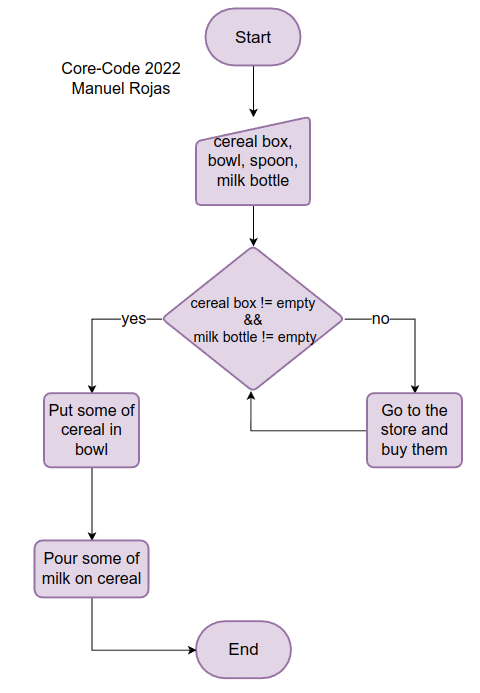

# Which comes first, cereal or milk?
## Description
Create an algorithm to prepare a bowl of cereal with milk. Represent the result in pseudocode and in a flowchart.

## Solution
### Pseudocode
1. Get ready cereal box, bowl, spoon, milk bottle
3. If cereal box or milk bottle is empty then
    1. Go to the store and buy them
2. If cereal box and milk bottle box isn't empty then
    1. Put some of cereal in bowl
    2. Pour some of milk on cereal
4. Enjoy it!

### Flowchart
