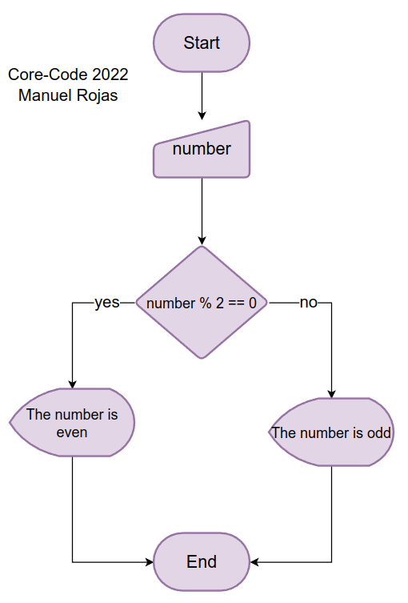

# Numbers
## Description
Design an algorithm to check if a number is even or odd. If it is even, write that it is even, otherwise write that it is odd. Represent the algorithm in a flowchart.

## Solution
```
START
    number <- USERINPUT;
    IF number % 2 == 0 THEN
        PRINT <- "The number is even";
    ELSE
        PRINT <- "The number is odd";
    ENDIF
END
```
